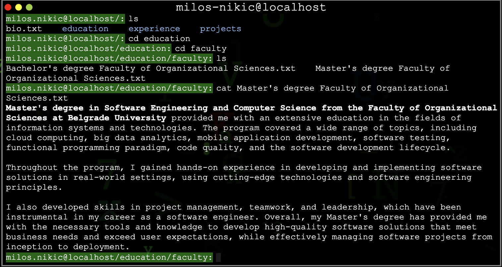

## Badges

[](https://choosealicense.com/licenses/mit/)

# Terminal Portfolio

This project was inspired by linux terminal and matrix theme.
It gives a brief overview about my personal information such as
education, past experience, projects and interests in a linux terminal style.

## Features

1. Present your portfolio in a linux terminal style
2. Content of each file can be changed pretty easy in `constants.js`
3. File system can be changed in constructor in `fs.js`
4. Choice between Dark/Light theme (either through terminal or clicking on toggle)
5. Cycling through history of commands using arrows

## Basic usage

File system structure looks like following:

```
- /
    - bio.txt
    - education
        - faculty
            - Bachelor's degree Faculty of Organizational Sciences.txt
            - Master's degree Faculty of Organizational Sciences.txt
    - experience
    - projects
        - FootballApp.txt
        - Battleship.txt
        - Magicmap.txt
        - Arduino Thermal System.txt
        - ASCII Art.txt
        - Cerberus.txt
        - Carvana.txt
```

## Commands

| Command   | Description                                           |
| --------- | ----------------------------------------------------- |
| `ls`      | Used to list content of directory                     |
| `cd`      | Used to change directory                              |
| `pwd`     | Prints path of current working directory              |
| `clear`   | Clears current terminal window                        |
| `cat`     | Displays content of the file specified                |
| `history` | Displays all previously called commands               |
| `help`    | Displays all possible commands with their description |
| `theme`   | Allows user to set preferred theme                    |

File system is consisted of files and directories. You can navigate through directories,
list their content, print output of file using `cat` command. Each file has
content that gives more details about me and my experience.

Whenever you change directory, current working directory will be present in host name.
But if that is not enough for you, try using `pwd`.

When terminal get overwhelmed with content, you can clear terminal window using `clear`.
If you forgot available commands type `help`. It will display all currently available commands
and their description.

You can change theme by clicking on toggle switch in top right corner, but cool way to change theme
is, of course, through terminal. Write command `theme` with argument (`dark` or `light`) in order
to change to specific theme.

## TODO

- [ ] Add functionality with arrows (left-right)
- [x] Add functionality with arrows (up-down) for browsing history
- [ ] Implement autocomplete suggestions
- [ ] Add comments functionality
- [x] Dark/Light theme
- [x] Commands history
- [ ] Help for individual command

## Authors

- [@milosnikic](https://www.github.com/milosnikic)

## License

[MIT](https://choosealicense.com/licenses/mit/)
